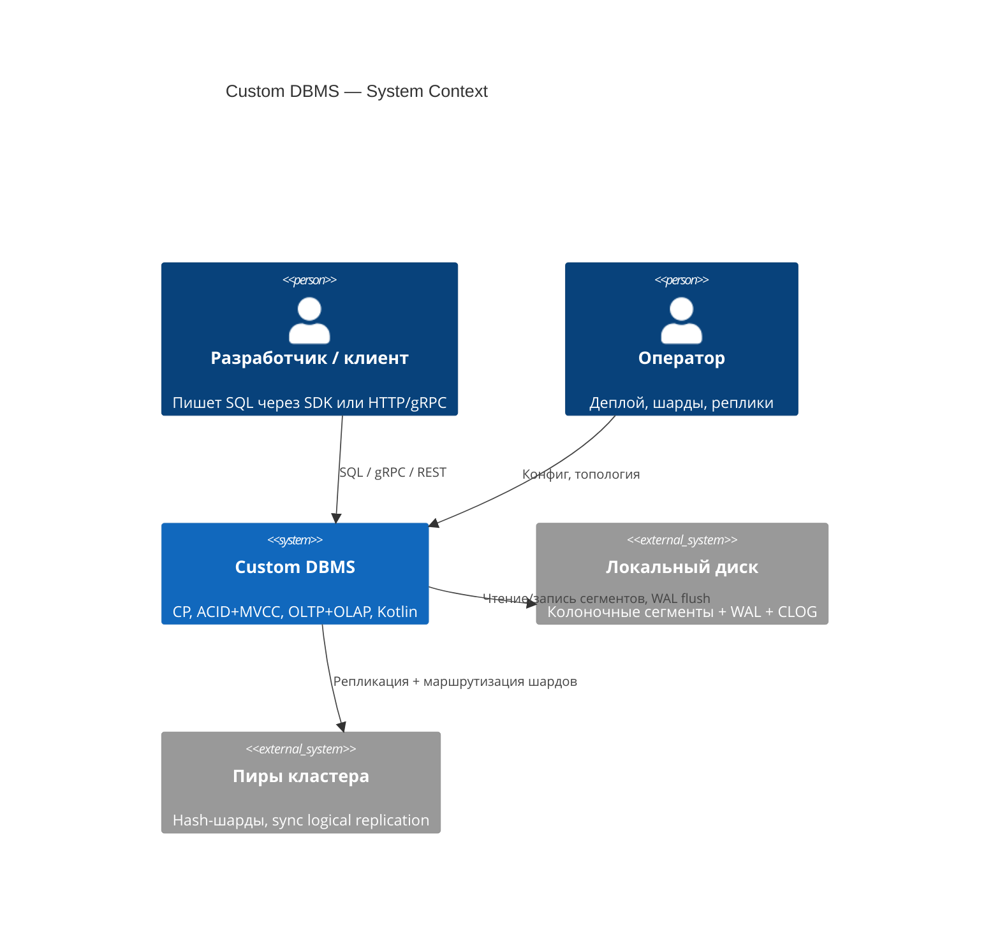

# C4 — Context (L1)

Система в окружении клиентов, оператора, диска и пиров кластера.

> Рендер: Mermaid C4 (`C4Context`). В превью Cursor может не открыться — смотри на [mermaid.live](https://mermaid.live) или в VS Code с поддержкой C4.

## Требования (из ТЗ)

- CP
- Kotlin + Gradle
- Интерфейсы → локальная БД → gRPC/REST → репликация/шардирование
