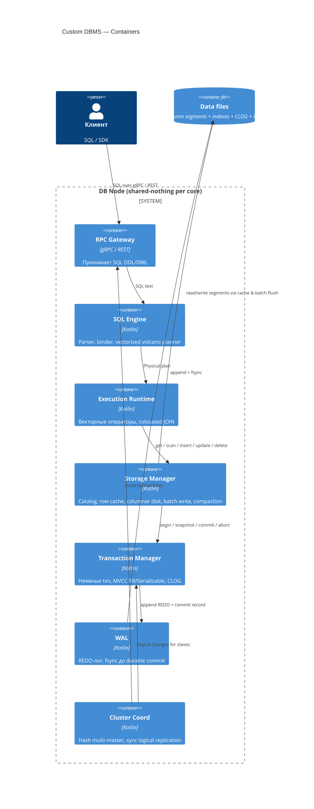

# C4 — Container (L2)

Контейнеры одного DB-узла (shared-nothing per core).

Явных `BEGIN`/`COMMIT` у клиента нет: SQL-запрос идёт в execution → **Storage Manager**, а тот внутри ходит в **Transaction Manager**.

> Рендер: Mermaid C4 (`C4Container`). Если превью Cursor пустое — [mermaid.live](https://mermaid.live).

## Поток записи (кратко)

1. Клиент шлёт DML (без явной транзакции).  
2. Exec вызывает Storage Manager.  
3. Storage Manager открывает неявную txn через Transaction Manager.  
4. Transaction Manager пишет WAL / CLOG; Storage Manager меняет row cache / готовит batch на диск.  
5. Commit → fsync WAL; flush сегментов на диск — позже (batch).

## Контейнеры

| Контейнер | Роль |
|-----------|------|
| RPC Gateway | Вход SQL |
| SQL Engine | Parser, binder, volcano planner |
| Execution Runtime | Исполнение плана |
| Storage Manager | Данные + каталог; **использует** Transaction Manager |
| Transaction Manager | Неявные ACID-транзакции, MVCC, CLOG |
| WAL | REDO, durability коммита |
| Cluster Coord | Шарды и sync logical replication |
