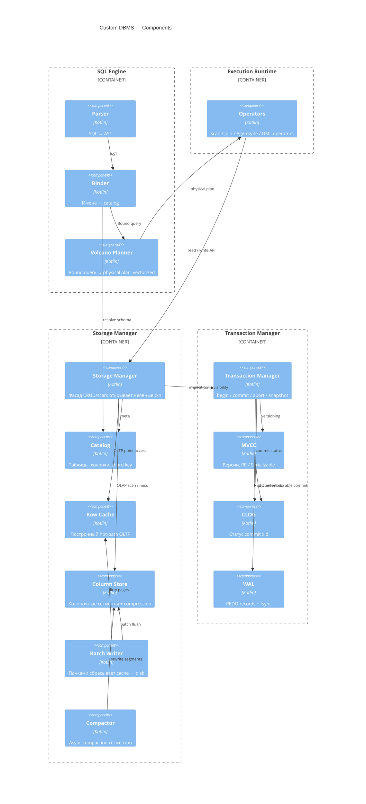

# C4 — Component (L3)

Компоненты SQL, Storage Manager и Transaction Manager.

Optimizer убран: план строит Volcano Planner.  
Row Cache **не** ходит в WAL — только Transaction Manager пишет лог.

> Рендер: Mermaid C4 (`C4Component`). Если превью Cursor пустое — [mermaid.live](https://mermaid.live).

## Что было не так раньше

| Было | Стало |
|------|--------|
| Optimizer → Row Cache / Column Store | Planner → Operators → Storage Manager |
| Row Cache → WAL | Storage Manager → Transaction Manager → WAL |
| SQL Engine → Txn (явные begin/commit) | Только Storage Manager → Transaction Manager |

## Принципы ТЗ

- Планировщик — vectorized volcano  
- Кеш — построчный (OLTP)  
- Диск — колоночный + сжатие (OLAP)  
- Batch write + async compaction  
- WAL (REDO) + CLOG внутри Transaction Manager  
