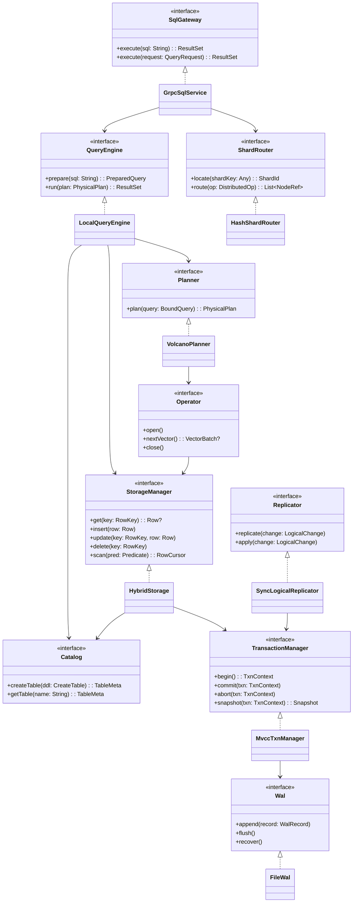

# Диаграмма классов

Скелет под лабораторные 1–2: интерфейсы, затем локальные реализации.

Явных транзакций в API клиента нет. `StorageManager` сам использует `TransactionManager` (неявная txn на операцию/запрос).

## Зависимости

- `QueryEngine` / `Operator` → `StorageManager` (данные)  
- `StorageManager` → `TransactionManager` (неявные txn, visibility)  
- `TransactionManager` → `Wal` (REDO + fsync)  
- Клиент **не** вызывает `TransactionManager`

## Привязка к лабам

1. Интерфейсы (`StorageManager`, `TransactionManager`, `QueryEngine`, …)  
2. Локальные реализации без сети  
3. `GrpcSqlService` / REST поверх `SqlGateway`  
4–5. `HashShardRouter` + `SyncLogicalReplicator`  
