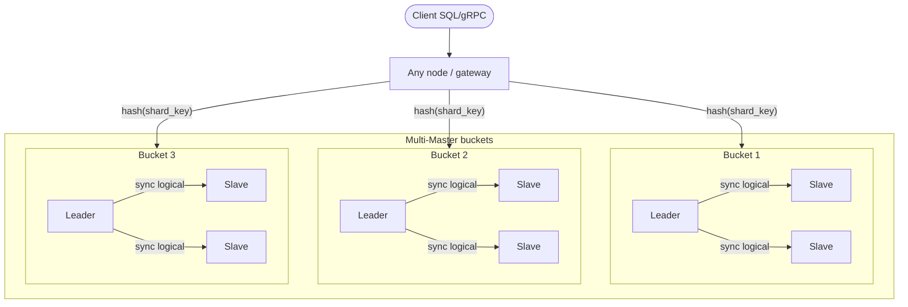

# Топология: hash sharding + sync replication

Из ТЗ: шардирование Hash / Multi-Master; репликация синхронная Master-slave, логическая.

## Заметки

- Каждый bucket — свой leader (multi-master на уровне шардов)
- Запись идёт на leader бакета, slaves получают sync logical changes
- Маршрутизация клиента: `hash(shard_key) → bucket → leader`
