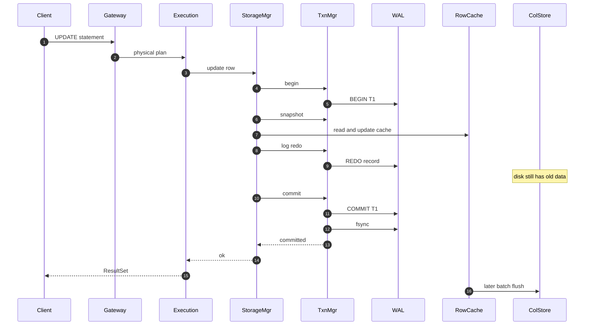

# Sequence: OLTP write (неявная txn)

Клиент не шлёт `BEGIN`/`COMMIT`. Их открывает Storage Manager через Transaction Manager.

## Принцип

1. DML без явной транзакции от клиента  
2. Storage Manager: `begin` → mutate cache → REDO через TxnManager → `commit`  
3. Durability коммита = fsync WAL  
4. Batch flush cache → columnar disk — асинхронно позже  
