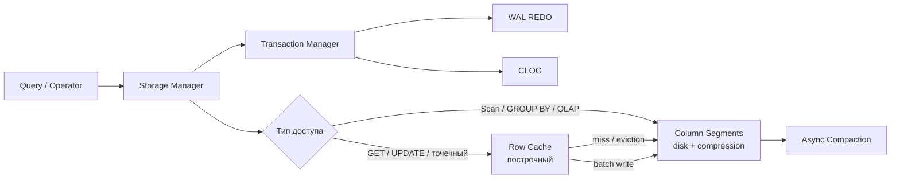

# Data flow: OLTP cache vs OLAP disk

Гибридное хранение из ТЗ. Мутации идут через Storage Manager → Transaction Manager, не напрямую cache → WAL.

## SQL-поверхность (из ТЗ)

**DML:** colocational JOIN, INSERT, UPDATE, GET, DELETE, WHERE, GROUP BY  

**DDL:** CREATE TABLE  
